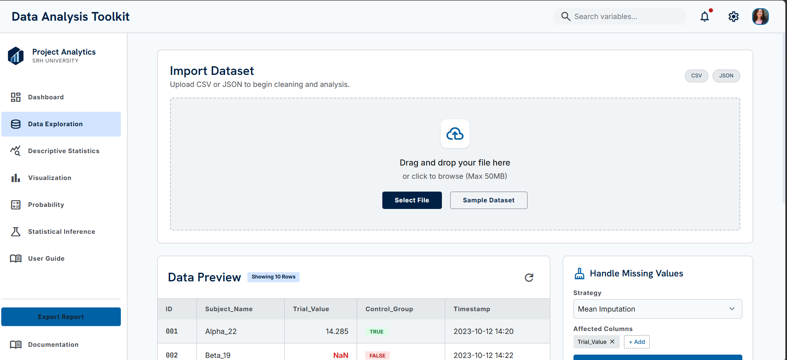

# Data Analysis Toolkit

A browser-based toolkit for exploring, processing, and analysing datasets — built for the **Tools and Methods of Data Analysis** course (K_mcs_003) at **SRH University**.

The entire toolkit runs in a single HTML page with no installation or server required. Just open it in your browser, import a dataset, and start analysing.



## Features

- **Import Dataset** — load your data from CSV or JSON files, or try it instantly with a built-in sample dataset.
- **Data Preview** — browse your data in a clean, paginated table (5–50 rows per page).
- **Data Cleaning** — handle missing values with strategies like drop rows, mean/median imputation, or fill with a constant.
- **Descriptive Statistics** — compute mean, median, mode, variance, standard deviation, and more.
- **Visualization** — generate histograms, bar charts, line charts, scatter plots, and pie/donut charts, with PNG export.
- **Probability** — work with probability distributions, including the normal distribution.
- **Statistical Inference** — run hypothesis tests including the one-sample **T-Test**, the **Shapiro-Wilk** normality test, and group comparisons, with configurable confidence levels (90/95/99%), significance levels (α = 0.01/0.05/0.10), and one- or two-tailed options.
- **User Guide** — built-in documentation to walk you through each module.

## How to Use

1. Download or clone this repository:
   ```bash
   git clone https://github.com/Keerthanakumbar/data-analysis-toolkit.git
   ```
2. Open `index.html` in any modern web browser (Chrome, Firefox, Edge).
3. Click **Import Dataset** to upload a CSV/JSON file, or load the **Sample Dataset** to explore.
4. Move through the modules — Data Preview, Descriptive Statistics, Visualization, Probability, and Statistical Inference — to analyse your data.

No installation, dependencies, or internet connection required.

## Files

- `index.html` — the complete toolkit (UI + logic in one file).
- `DESIGN.md` — the design system: colours, typography, layout, and component specs.
- `screen.png` — a screenshot of the interface.

## Built With

- HTML, CSS, and JavaScript (no external frameworks required to run)
- A custom design system documented in `DESIGN.md`

## About

Created by **Keerthana Kumbar** as part of the Master's coursework in *Tools and Methods of Data Analysis (K_mcs_003)* at SRH University.
